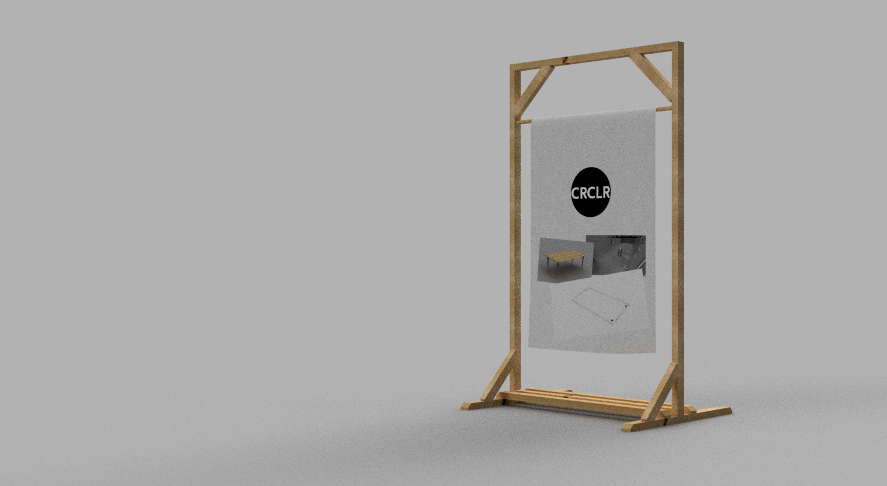

# OpenEventSpace
Modular system of easy to build structural panels for room dividers, stages and exhibition furniture. Originally designed for [The Circular Lab](http://crclr.org/), [Agora Collective](http://agoracollective.org), [Open Source Circular Economy Days](https://oscedays.org/) by Alex Shure and Marie-Anaïs Bluteau. 

Matching desks and tables of various heights are offloaded to this repo: https://github.com/etemu/OpenDeskAriane

Panels are optimized for 
1. best use of stock material, minimal operations, minimal waste
2. weight, all components can be carried by two people
3. modularity, connectivity, integrated storage
4. ease of assembly and disassembly

Making of (click for video):

In addition to standard panels there are models for triangular shaped ones and light emitting panels incorporating efficient LED lamps.

All furniture can be disassembled for storage without tools. Table and desk legs are fastened by hand. Turning them clockwise will tighten the integrated machine screws. When not in use, furniture can be stored at any wall without the use of dedicated hooks due to the integrated french cleats:

Panels can be connected in every direction, ie. to long rows or T-shaped room dividers. Groups of up to 5 panels can be daisy-chained and suspended from the ceiling. All different panel shapes can be connected and carried by two people.

Based on the supplied load simulations the structural integrity is sufficient for a temporary use as a horizontal platform. Panels can be stacked and laid flat to form an elevated stage. 

